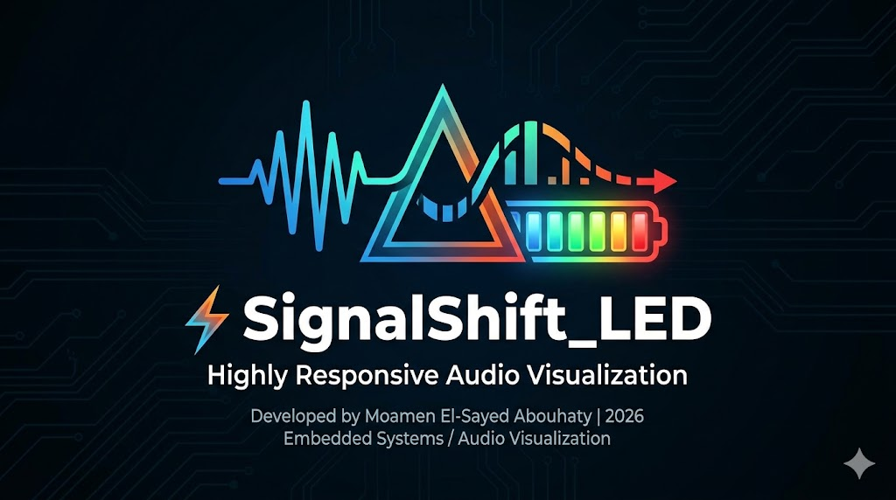

# ⚡ Signal-Shift-LED

---

---

**Author:** Moamen El-Sayed Abouhaty

---

**Category:** Embedded Systems / Audio Visualization

---

## 📝 Description
**SignalShift_LED** is a high-responsivity audio visualizer built on the Arduino platform. It translates ambient sound waves into a dynamic 6-LED "Battery-Style" level meter. By leveraging differential signal analysis and a low-voltage reference, the system can detect subtle acoustic changes that standard threshold-based sensors often miss.

---

## 🚀 Key Technical Features
* **Differential Detection:** Instead of measuring absolute volume, the code calculates the *Delta* ($\Delta$) between consecutive samples, allowing it to trigger on sudden sounds regardless of background noise levels.
* **Enhanced ADC Resolution:** By switching the `analogReference` to `INTERNAL` (1.1V), the system achieves nearly 5x the sensitivity of standard 5V logic.
* **Real-Time Mapping:** Uses a custom linear mapping function to distribute sound intensity across a 6-pin LED array.
* **Ultra-Low Latency:** A 5ms polling cycle ensures the LEDs "dance" in perfect synchronization with the audio source.

---

## 🛠️ Hardware Setup
| Component | Pin / Connection |
| :--- | :--- |
| **Microphone Output** | Analog Pin **A0** |
| **LEDs (1-6)** | Pins **12, 10, 8, 6, 4, 2** |
| **Resistors** | 220Ω for each LED |
| **Power** | 5V and GND from Arduino |

---

## 💻 Code Logic (The "Shift")
The "Shift" occurs in the main loop where the software translates a voltage spike into a visual count:

1. **Sample:** Read current analog value.
2. **Calculate:** Find the difference $|Value_{now} - Value_{last}|$.
3. **Map:** Convert that difference (0-12) to an LED count (0-6).
4. **Shift:** Power the corresponding LEDs while grounded the rest.

---

## ⚙️ Calibration
To tune your **SignalShift_LED**:
1. Open the Serial Monitor at **9600 baud**.
2. Observe the `delta` values during silence vs. during sound.
3. Adjust the `maxDelta` constant in the code to match your environment's acoustics.

---

**Developed by Moamen El-Sayed Abouhaty  | 2026**